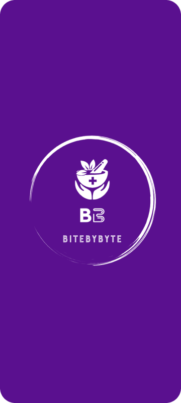

# BiteByByte- Anorexia Wellness App

### Problem Statement

Anorexia nervosa is a severe mental health condition prevalent among teenagers, exacerbated by societal pressures and social media influence. Despite increased awareness of mental health issues, existing platforms lack tailored solutions for teens struggling with anorexia. There is a critical need for an innovative wellness app designed to empower teens through education, support, and effective recovery tools.

### Our Solution - BiteByByte

BiteByByte is a comprehensive platform addressing anorexia challenges among teenagers. It empowers teens through education, support blogs, health monitoring tools, and a robust community support system. Key features include awareness and recovery blogs, personalized health monitoring tools, and an SOS button for immediate assistance.

### Features

1. **Awareness and Recovery Blogs:**
   - Engaging articles covering anorexia information, personal recovery, and positive mindset advice.
   - A virtual guide for understanding and inspiration.

2. **Health Monitoring and Calorie Tracking:**
   - Powerful tools for tracking, goal setting, and calorie monitoring.
   - Gamified system for daily achievements and special rewards.

3. **Community Support and SOS Button:**
   - Building a supportive community through story-sharing and forums.
   - Integrated SOS button for immediate assistance, prioritizing user safety.

### USP

BiteByByte stands out with its user-friendly Figma design and financial model crafted . It goes beyond being just an application; it's a way of life for teens dealing with anorexia. BiteByByte leverages technology humorously and engagingly to raise awareness, inspire healing, and change lives.

### Tech Implementation

BiteByByte, a web application, utilizes JavaScript and React for an interactive, gamified UI. Machine learning algorithms enhance personalized features like meal planning, chatbot interactions, and dynamic rewards, ensuring an optimal and immersive user experience.

### Figma Designs

We have incorporated innovative designs to ensure a visually appealing and user-friendly experience. You can explore the interactive prototypes, user interfaces, and the thoughtfully crafted design elements that make BiteByByte not only functional but also aesthetically pleasing.

 

### Market Research

- **Anorexia Market Size:**
  - Estimated to increase with a significant CAGR (2023-2032).
  - Leading companies include COMPASS Pathways, Homeostasis Therapeutics, NEDA, AED, and more.

- **Prevalence:**
  - 1,692,817 cases in 7MM in 2021, expected to increase by 2032.
  - US has the highest prevalence with 703,497 cases in 2021.

### Anorexia Nervosa Treatment Market

- **Market Growth:**
  - Expected to reach multimillion USD by 2030, with an unexpected CAGR.

- **Impact of COVID-19 and Russia-Ukraine War:**
  - Comprehensive analysis provided on how these global events impact the Anorexia Nervosa Treatment industry.

### References

- [DelveInsight Anorexia Market Report](https://www.delveinsight.com/report-store/anorexia-market)
- [An Indian Perspective - ResearchGate](https://www.researchgate.net/publication/41396435_Anorexia_nervosa_An_Indian_perspective)
- [Burden of Anorexia Nervosa in India - ResearchGate](https://www.researchgate.net/publication/328691186_A_study_of_burden_of_anorexia_nervosa_in_India_-_2016)
- [Anorexia Nervosa Treatment Market Analysis - MENAFN](https://menafn.com/1107581042/Anorexia-Nervosa-Treatment-Market-Analysis-And-Forecast-To-2031)

### Case Studies and Interesting Articles

- [Media India - Suffering in Silence](https://mediaindia.eu/society/suffering-in-silence-eating-disorders-go-unnoticed-in-india/)
- [Times of India - Love Hormone May Help Fight Anorexia](https://timesofindia.indiatimes.com/home/science/love-hormone-may-help-fight-anorexia/articleshow/31978904.cms?from=mdr)

---
